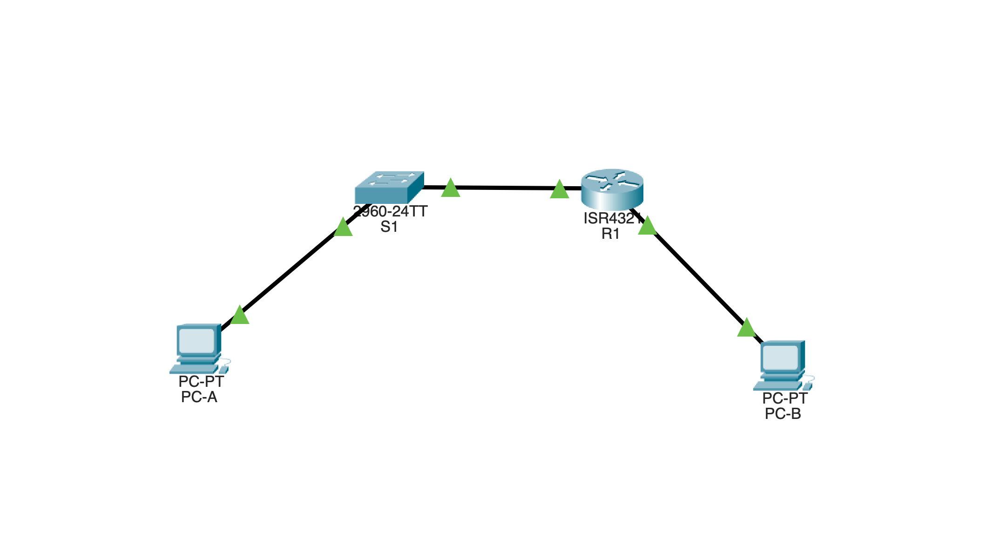
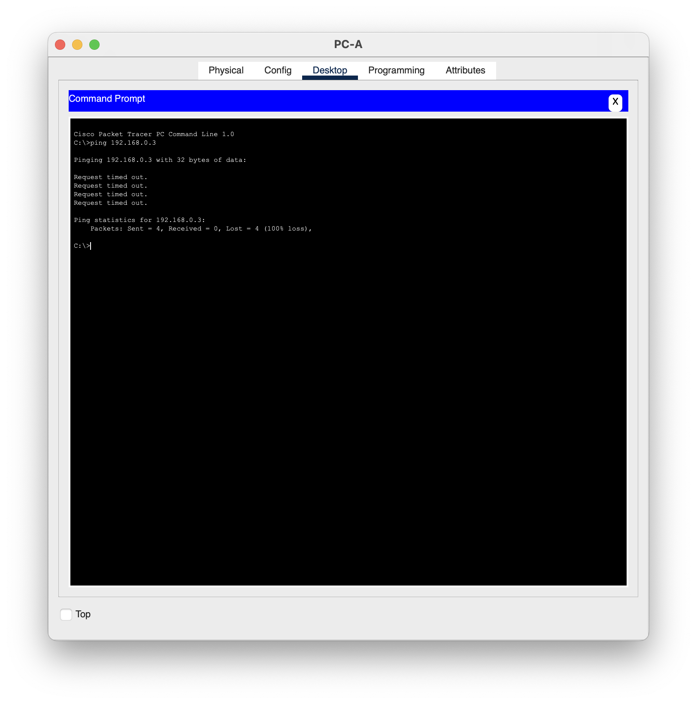

<h1 align="center">🌐 Konfigurasi Jaringan Dasar dengan Router, Switch, dan PC</h1>

<p align="center">
  
  
  
  
  
</p>

---

## 🧩 Deskripsi
Proyek ini merupakan hasil praktikum **Konfigurasi Jaringan Dasar** menggunakan **Cisco Packet Tracer**.  
Tujuan utama dari kegiatan ini adalah membangun dan mengonfigurasi **jaringan sederhana** yang terdiri dari **router, switch, dan dua PC**, serta melakukan pengujian konektivitas menggunakan **IPv4** dan **IPv6**.

---

## 🎯 Tujuan
- Membuat topologi jaringan sederhana.
- Melakukan konfigurasi IP Address (IPv4 & IPv6).
- Mengatur hostname, password, dan banner keamanan pada router dan switch.
- Melakukan verifikasi dan pengujian konektivitas antar-perangkat.

---

## 🛜 Topologi Jaringan
```bash
PC-B  <——>  R1  <——>  S1  <——>  PC-A
```
### Screenshot Topologi
<p align="center">
  
</p>

> Semua koneksi menggunakan **kabel straight-through** karena antar perangkat berbeda jenis.

---

## 📋 Tabel IP Address

| Device | Interface | IPv4 Address | Default Gateway | IPv6 Address |
|:-------|:-----------|:--------------|:----------------|:--------------|
| R1 | G0/0/0 | 192.168.0.1/24 | - | 2001:db8:acad::1/64 |
| R1 | G0/0/1 | 192.168.1.1/24 | - | 2001:db8:acad:1::1/64 |
| S1 | VLAN 1 | 192.168.1.2/24 | 192.168.1.1 | - |
| PC-A | NIC | 192.168.1.3/24 | 192.168.1.1 | 2001:db8:acad:1::3/64 |
| PC-B | NIC | 192.168.0.3/24 | 192.168.0.1 | 2001:db8:acad::3/64 |

---

## ⚙️ Konfigurasi Perangkat

### 🔹 Router (R1)
```bash
enable
config terminal
hostname R1
no ip domain-lookup
enable secret class
line console 0
 password cisco
 login
line vty 0 4
 password cisco
 login
service password-encryption
banner motd $ Authorized Users Only! $
```
```bash
interface g0/0/0
 description Connected to PC-B
 ip address 192.168.0.1 255.255.255.0
 ipv6 address 2001:db8:acad::1/64
 ipv6 address fe80::1 link-local
 no shutdown
```
```bash
interface g0/0/1
 description Connected to S1 (F0/5)
 ip address 192.168.1.1 255.255.255.0
 ipv6 address 2001:db8:acad:1::1/64
 ipv6 address fe80::1 link-local
 no shutdown
```
```bash
ipv6 unicast-routing
copy running-config startup-config
```
### 🔹 Switch (S1)
```bash
enable
config terminal
hostname S1
no ip domain-lookup
interface vlan 1
 ip address 192.168.1.2 255.255.255.0
 no shutdown
exit
ip default-gateway 192.168.1.1
copy running-config startup-config
```
### 🔹 PC 
Perangkat	IPv4	Subnet Mask	Gateway	IPv6
- PC-A	192.168.1.3	255.255.255.0	192.168.1.1	2001:db8:acad:1::3/64
- PC-B	192.168.0.3	255.255.255.0	192.168.0.1	2001:db8:acad::3/64

---

## 🧪 Pengujian Konektivitas

### 1️⃣ Ping dari PC-A ke PC-B
```bash
ping 192.168.0.3
```
#### ⚠️ Sebelum Konfigurasi
<p align="center">
  
</p>
❌ Hasil: Ping gagal, menandakan konfigurasi dan routing antar jaringan belum dilakukan.

#### ⚠️ Setelah Konfigurasi
<p align="center">
  
</p>
✅ Hasil: Ping berhasil, menandakan konfigurasi dan routing antar jaringan sudah berfungsi.

### 2️⃣ Verifikasi dengan Show Commands
```bash
R1# show ip interface brief
R1# show ipv6 interface brief
R1# show ip route
R1# show ipv6 route
S1# show ip interface brief
```

---

## 🧠 Pertanyaan Refleksi
1. Jika interface G0/0/1 administratively down → aktifkan dengan perintah no shutdown.
2. Jika G0/0/1 diberi IP 192.168.1.2, maka PC-A tidak dapat ping ke PC-B karena berada di jaringan berbeda dan gateway default 192.168.1.1 tidak terhubung ke perangkat mana pun, sehingga paket tidak dapat dirutekan.
3. Kode routing C = Connected network.
4. Jumlah route dengan kode C = 2 (G0/0/0 dan G0/0/1).

---

## 📁 File Proyek
File hasil konfigurasi:
**TA2_M. Hibban Ramadhan_JK-E.pkt**

---
## 🎥 Video Tutorial
<p align="center">
  <a href="https://youtu.be/-EBb4JbHD8E?si=iicTO_e6QRoq_nJo" target="_blank">
    
  </a>
</p>

> Klik badge di atas untuk menonton tutorial konfigurasi jaringan dasar menggunakan Cisco Packet Tracer.
---
## 👨‍💻 Pembuat 
```
Nama: Muhamad Hibban Ramadhan
Program Studi: Teknik Informatika
Semester: 5
Kampus: Universitas Lampung
Mata Kuliah: Praktikum Jaringan Komputer
```