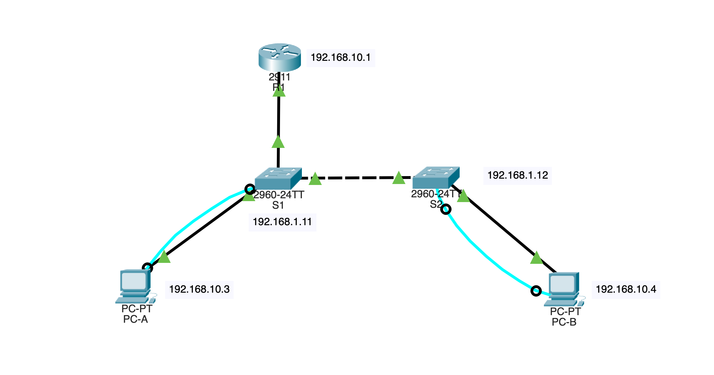
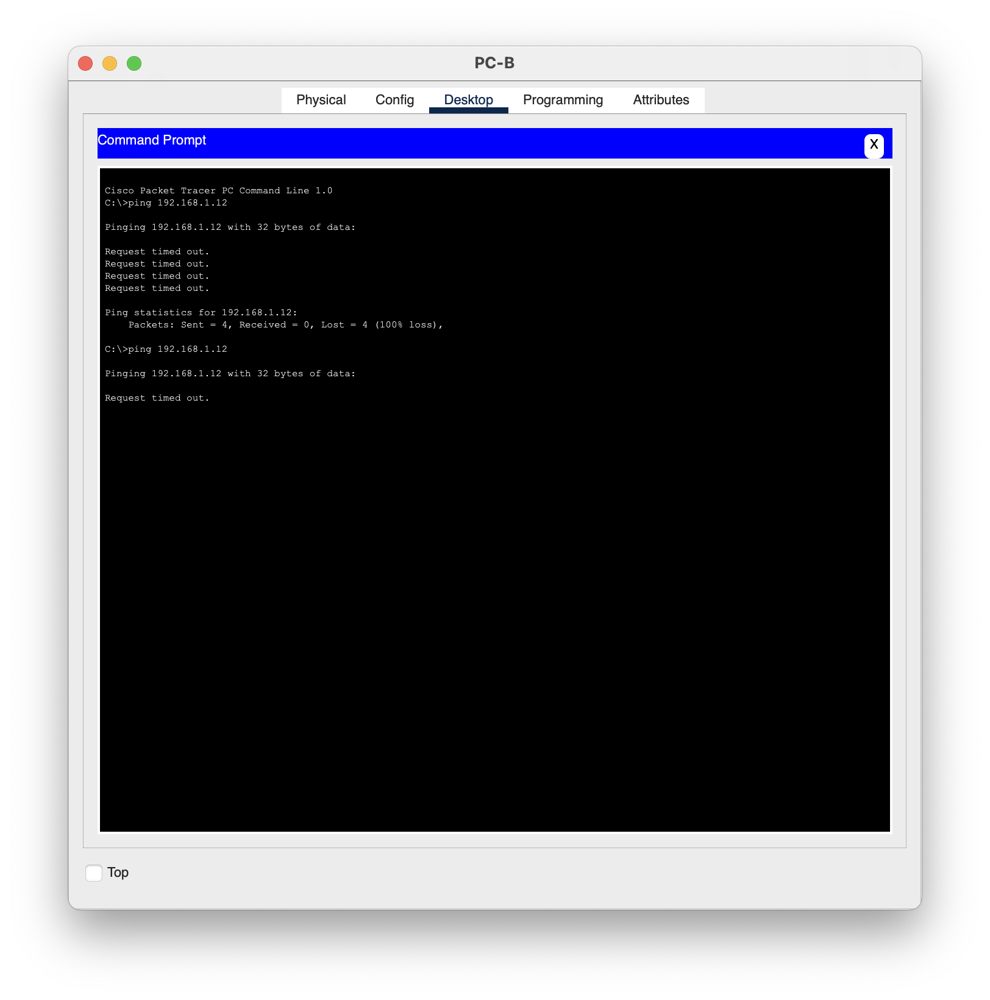
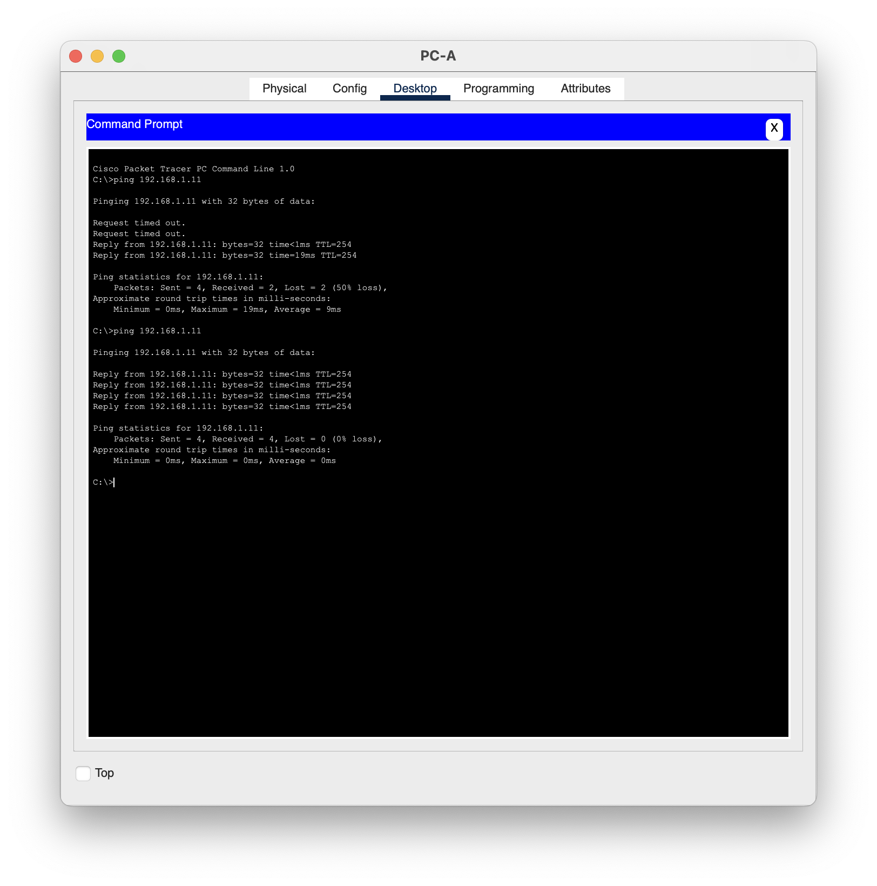

<h1 align="center">🛰️ Konfigurasi Inter-VLAN Routing (Router-on-a-Stick)</h1>

<p align="center">
  
  
  
  
</p>

---

## 🧩 Deskripsi
Proyek ini merupakan implementasi **Router-on-a-Stick (Inter-VLAN Routing)** menggunakan **Cisco Packet Tracer**.  
Tujuannya adalah agar **PC dari VLAN berbeda** dapat saling berkomunikasi melalui **router tunggal** yang berfungsi merutekan lalu lintas antar VLAN melalui **subinterface**.

---

## 🎯 Tujuan
- Membuat **topologi jaringan** dengan beberapa VLAN.  
- Melakukan **konfigurasi trunking** antara router dan switch.  
- Membuat **subinterface pada router** untuk masing-masing VLAN.  
- Menguji konektivitas antar VLAN menggunakan perintah `ping`.

---

## 🛜 Topologi Jaringan
```bash
PC-A (VLAN 10) —— S1 —— G0/0 Router (Subinterface)
PC-B (VLAN 20) ——┘
```

### Screenshot Topologi

<p align="center">
  
</p>

> Semua perangkat dihubungkan menggunakan **kabel straight-through**, dan port antar switch-router dikonfigurasi sebagai **trunk**.

---

## 📋 Tabel IP Address

| Device      | Interface | VLAN | IPv4 Address  | Subnet Mask   | Default Gateway |
| :---------- | :-------- | :--- | :------------ | :------------ | :-------------- |
| Router (R1) | G0/0.10   | 10   | 192.168.10.1  | 255.255.255.0 | -               |
| Router (R1) | G0/0.20   | 20   | 192.168.20.1  | 255.255.255.0 | -               |
| Switch (S1) | VLAN 1    | -    | 192.168.1.2   | 255.255.255.0 | 192.168.1.1     |
| PC-A        | NIC       | 10   | 192.168.10.10 | 255.255.255.0 | 192.168.10.1    |
| PC-B        | NIC       | 20   | 192.168.20.10 | 255.255.255.0 | 192.168.20.1    |

---

## ⚙️ Konfigurasi Perangkat

### 🔹 Router (R1)

```bash
enable
config terminal
hostname R1
no ip domain-lookup
```

#### Subinterface VLAN 10

```bash
interface g0/0.10
 encapsulation dot1Q 10
 ip address 192.168.10.1 255.255.255.0
 no shutdown
```

#### Subinterface VLAN 20

```bash
interface g0/0.20
 encapsulation dot1Q 20
 ip address 192.168.20.1 255.255.255.0
 no shutdown
```

#### Aktifkan Interface Fisik

```bash
interface g0/0
 no shutdown
exit
copy running-config startup-config
```

---

### 🔹 Switch (S1)

```bash
enable
config terminal
hostname S1
vlan 10
 name HR
vlan 20
 name IT
```

#### Konfigurasi Port Access

```bash
interface f0/1
 switchport mode access
 switchport access vlan 10
exit

interface f0/2
 switchport mode access
 switchport access vlan 20
exit
```

#### Konfigurasi Trunk ke Router

```bash
interface f0/5
 switchport mode trunk
 switchport trunk encapsulation dot1q
 switchport trunk allowed vlan 10,20
exit
copy running-config startup-config
```

---

### 🔹 PC Configuration

| PC   | VLAN | IP Address    | Subnet Mask   | Default Gateway |
| :--- | :--- | :------------ | :------------ | :-------------- |
| PC-A | 10   | 192.168.10.10 | 255.255.255.0 | 192.168.10.1    |
| PC-B | 20   | 192.168.20.10 | 255.255.255.0 | 192.168.20.1    |

---

## 🧪 Pengujian Konektivitas

### 1️⃣ Ping antar VLAN

#### Dari PC-A (VLAN 10) ke PC-B (VLAN 20)

```bash
ping 192.168.20.10
```

#### ⚠️ Sebelum Konfigurasi Router

<p align="center">
  
</p>
❌ Hasil: Gagal — antar VLAN tidak bisa berkomunikasi karena belum ada routing.

#### ✅ Setelah Konfigurasi Router-on-a-Stick

<p align="center">
  
</p>
✅ Hasil: Berhasil — router berhasil merutekan antar VLAN.

---

### 2️⃣ Verifikasi Konfigurasi

```bash
R1# show ip interface brief
R1# show interfaces g0/0.10
R1# show interfaces g0/0.20
S1# show vlan brief
S1# show interfaces trunk
```

---

## 🧠 Pertanyaan Refleksi

1. **Mengapa diperlukan subinterface pada router?**
   Karena router hanya memiliki satu port fisik, subinterface digunakan agar satu interface dapat menangani beberapa VLAN melalui trunking.

2. **Apa fungsi perintah `encapsulation dot1Q <vlan-id>`?**
   Untuk memberi tahu router VLAN mana yang dikaitkan dengan subinterface tersebut.

3. **Mengapa PC antar VLAN awalnya tidak bisa berkomunikasi?**
   Karena VLAN berbeda berarti broadcast domain berbeda, perlu perantara router agar lalu lintas bisa dirutekan.

---

## 📁 File Proyek

**`TA_RouterOnAStick_MuhamadHibbanRamadhan_JK-E.pkt`**

---

## 🎥 Video Tutorial

<p align="center">
  <a href="https://youtu.be/XDKPm6GIhCI?si=yUzmCN3D5UJDP0v6" target="_blank">
    
  </a>
</p>

> Klik badge di atas untuk menonton tutorial konfigurasi **Router-on-a-Stick** di Cisco Packet Tracer.

---

## 👨‍💻 Pembuat

```
Nama: Muhamad Hibban Ramadhan
Program Studi: Teknik Informatika
Semester: 5
Kampus: Universitas Lampung
Mata Kuliah: Praktikum Jaringan Komputer
Judul: Configure Inter-VLAN Routing (Router-on-a-Stick)
```